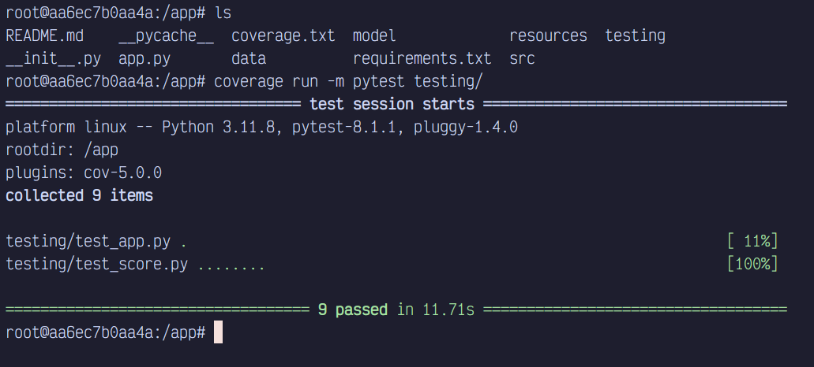

# Containerization & Continuous Integration

This assignment is a part of the Applied ML course of my MSc. Data Science Program at Chennai Mathematical Institute.

## Problem statement

Assignment 4: Containerization & Continuous Integration [due 28 Mar 2024]

1. **Containerization**
   - create a docker container for the flask app created in Assignment 3
   - create a Dockerfile which contains the instructions to build the container, which include
     - installing the dependencies
     - copying app.py and score.py
     - launching the app by running “python app.py” upon entry
   - build the docker image using Dockerfile
   - run the docker container with appropriate port bindings
   - in test.py write `test_docker(..)` function which does the following
     - launches the docker container using commandline (e.g. os.sys(..), docker build and docker run)
     - sends a request to the localhost endpoint /score (e.g. using requests library) for a sample text
     - checks if the response is as expected
     - close the docker container
   - In coverage.txt, produce the coverage report using pytest for the tests in test.py
2. **Continuous Integration**
   - write a pre-commit git hook that will run the `test.py` automatically every time you try to commit the code to your local ‘`main`’ branch
   - copy and push this pre-commit git hook file to your git repo

## Future guide for installing and running docker on arch (and other linux systems)

1. Download docker engine from the package repositories (for arch, look in aur)
2. Download docker-buildx from aur
3. On a terminal session run `sudo dockerd`. In case there are any problems, then reboot and run this command again.
4. Open a new terminal session and run `sudo chown $USER /var/run/docker.sock`.
5. Finally run `docker build --network=host -t imagename:tag .`.
6. To start the container in a detached mode run  
    `docker run -d --name container_name image_name tail -f /dev/null`
7. To attach an interactive terminal to the container run  
    `docker exec -it container_name /bin/bash`

Screenshot of successful test case run inside docker container
