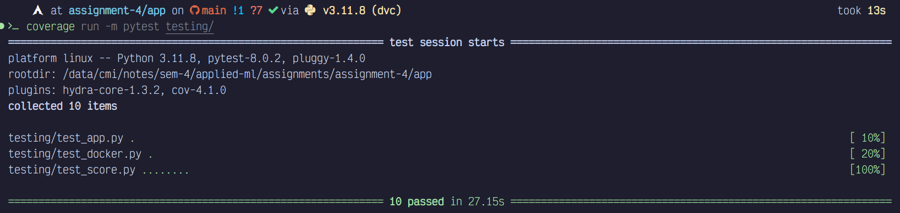

# Flask app

- [app.py](app.py) initialises the app and the scoring endpoint
- [resources/score.py](resources/score.py) defines the logic for the post method in the scoring endpoint
- [src](src/) contains the scoring code.
- [testing](testing/) contains the test cases as follows:
  - [testing/test_score.py](testing/test_score.py) tests the scoring function
  - [testing/test_app.py](testing/test_app.py) tests the flask app
- [coverage.txt](coverage.txt) contains the coverage report.
- Screenshot of successful test case runs
   